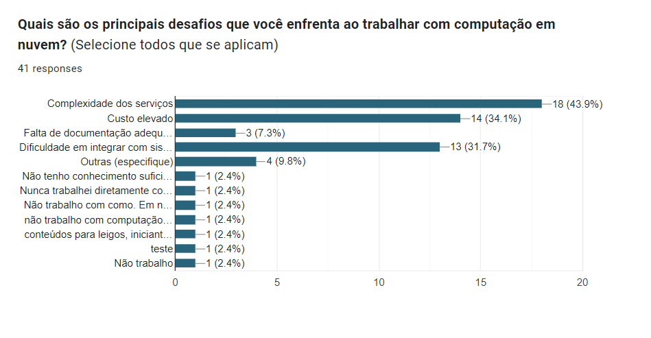

# Análise de Dados de Computação em Nuvem

Este projeto foi criado para analisar dados de uma pesquisa sobre computação em nuvem para mulheres, utilizando Python e as bibliotecas `pandas` e `matplotlib` para gerar gráficos de visualização.

## Arquivos

- **data.py**: Script Python que carrega os dados da planilha Excel e gera gráficos baseados nas respostas da pesquisa.
- **cap_nuvem_response.xlsx**: Planilha Excel com os dados da pesquisa.

## Requisitos

- Python 3.x
- Bibliotecas Python:
  - `pandas`
  - `matplotlib`

## Gráficos Gerados

### Gráficos de Pizza
1. **Distribuição de Gênero**  
   

2. **Nível de Conhecimento em Computação em Nuvem**  
   

3. **Certificação em Computação em Nuvem**  
   

4. **Motivação para Aprender sobre Computação em Nuvem**  
   

5. **Participação em Treinamento sobre Computação em Nuvem**  
   

6. **Nível de Escolaridade**  
   

7. **Faixa Etária**  
   

### Gráficos de Barras
1. **Tópicos de Computação em Nuvem Desejados**  
   

2. **Plataforma de Nuvem Mais Utilizada**  
   

3. **Desafios ao Trabalhar com Computação em Nuvem**  
   

4. **Formato de Capacitação Preferido**  
   
